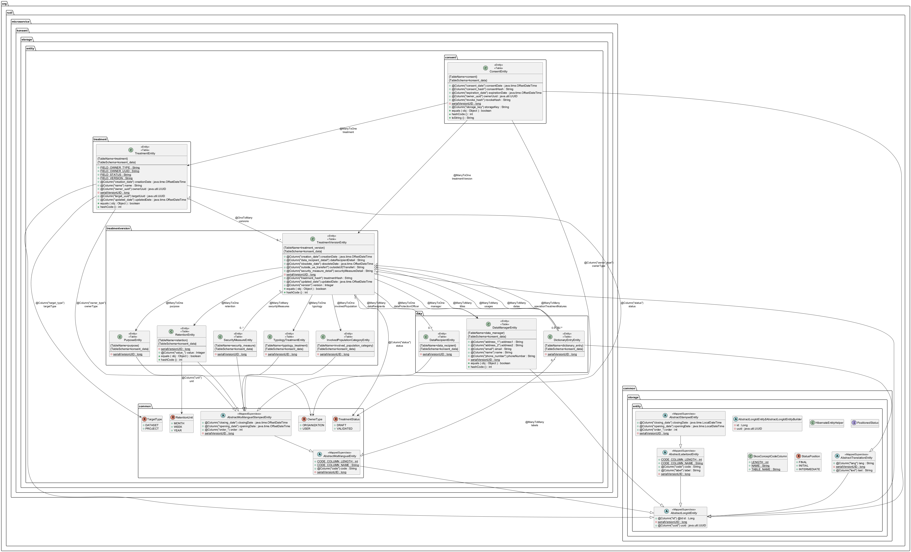

# Microservice Konsent

## Présentation générale

Le microservice Konsent est utilisé pour la gestion du consentement des utilisateurs.

## Architecture technique

Le microservice suit l'architecture standard des microservices RUDI avec trois couches principales:

```mermaid
graph TD
    A[API/Facade Layer] --> B[Service Layer]
    B --> C[Storage/DAO Layer]
    C --> D[(Database)]
```
## Structure du code

Le microservice est organisé en plusieurs modules:

- **rudi-microservice-konsent-facade**: Points d'entrée REST et contrôleurs
- **rudi-microservice-konsent-service**: Logique métier et services
- **rudi-microservice-konsent-storage**: Persistence des données et DAO
- **rudi-microservice-konsent-core**: Modèles et objets partagés

## Diagramme de classes

## Configuration

### Exemple de configuration

Un exemple de fichier de configuration est disponible [ici](../../../rudi-microservice/rudi-microservice-konsent/rudi-microservice-konsent-facade/src/main/resources/konsent-exemple.properties).

