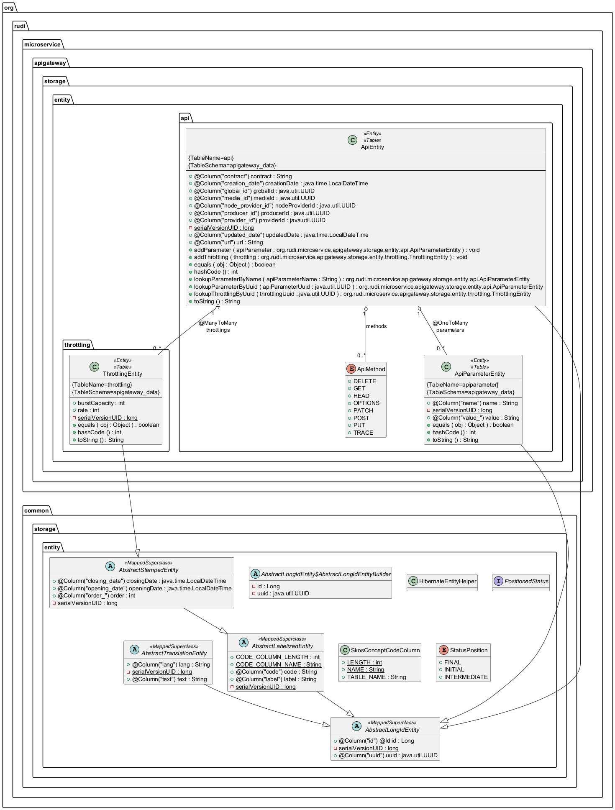

# Rudi - µService ApiGateway

Le µService ApiGateway est une gateway permettant l'accès aux données des Apis exposées

## All about throttling using redis

https://spring.io/blog/2021/04/05/api-rate-limiting-with-spring-cloud-gateway

https://medium.com/@htyesilyurt/implement-rate-limiting-in-spring-cloud-gateway-with-redis-7b71c8dd53a3

https://www.baeldung.com/spring-cloud-gateway-rate-limit-by-client-ip

## Initialisation de la configuration du service

Le service utilise un Java KeyStore (JKS) pour enregistrer les clés de chiffrement des media dont le contenu est chiffré.

Le JKS initial est déposé dans le répertoire de configuration du service. Il contient une clé de chiffrement "par défaut", renvoyée lorsque le service de récupération de clé publique (getEncryptionKey) est appelé sans mediaId. Au fur et à mesure de l'ajout de media chiffrés (appel de getEncryptionKey avec un mediaId), des nouvelles clés sont ajoutées. Elles ont une durée de vie de 5 ans et le certificat associé (autosigné) a une durée de vie de 10 ans.

Pour le lancement du service sur un environnement de développement, il est nécessaire d'ajouter une propriété indiquant le répertoire contenant ce JKS. Le JKS initial (de référence) doit y être copié, puis c'est ce fichier "local" qui sera complété au fur et à mesure des appels.

Le fichier ``rudi-apigateway.jks`` initial (celui de ``src/main/resource`` par exemple) doit être copié dans ``C:/<votre chemin local>/`` 

Puis la propriété ``-Dspring.config.additional-location=file:C:/<votre chemin local>/`` doit être ajoutée au lancement de votre configuration.

# Diagramme de classes

