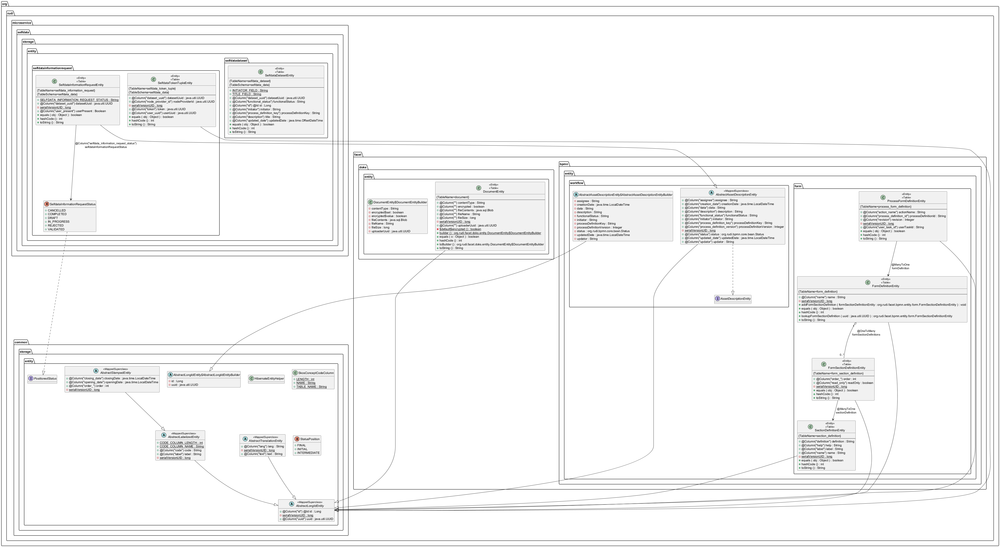

# Rudi - µService Selfdata
 
Le µService Selfdata permet la gestion des données personnelles.

On se base sur le swagger RUDI-PRODUCER-ext_selfdata_content.yml pour décrire la partie SelfData contenue dans
la propriété `ext_metadata.ext_selfdata.ext_selfdata_content` d'un jeu de données.


## Migration de données

Si l'on souhaite chiffrer des données non chiffrées (migration de données anciennes), il est possible d'utiliser le point d'entrée suivant sans paramètre : 

```
http(s):///<host>:<port>/selfdata/api/v1/admin/recrypt
```

## Gestion de la clé de chiffrement des données pivots

L'ajout d'une clé dans le coffre-fort peut-être réalisée de la manière suivante :

```
keytool.exe" -genseckey -alias <alias> -keystore rudi-selfdata.jks -storepass <mot de passe> -keyalg AES -keysize 256 -keypass <mot de passe> -storetype PKCS12
```

En cas de compromission de la clé de chiffrement, il convient :

- De modifier le mot de passe du coffre fort

```
keytool.exe" -storepasswd -keystore rudi-selfdata.jks -storepass <ancien-mot de passe> -new <new-password>
```

- Ajouter une nouvelle clé de chiffrement pour les données pivots dont l'alias porte la date du jour

```
keytool.exe" -genseckey -alias <alias>-<yyyyMMdd> -keystore rudi-selfdata.jks -storetype PKCS12 -keyalg AES -keysize 256 -storepass <mot de passe> -keypass <mot de passe> 
```

- Executer le point d'entrée suivant 

```
http(s):///<host>:<port>/selfdata/api/v1/admin/recrypt?previous-alias-key=<alias compromis>
```

## Diagramme de classes



